<a name="HOLTitle"></a>

# Hands-on Lab #1 - Azure Functions #

<a name="Overview"></a>

## Visão geral ##

Funções tem sido usadas como a forma básica de construção de blocos básicos do software desde que as primeiras linhas de código foram escritas e a necessidade de organização de código e reutilização se tornou uma necessidade. As funções do Azure (Azure Functions) expandem esses conceitos, permitindo que os desenvolvedores criem funções &quot;serverless&quot; (sem servidor), dirigidas por eventos que sejam executadas na nuvem e podem ser compartilhadas em uma ampla variedade de serviços e sistemas, gerenciados uniformemente e facilmente dimensionados com base na demanda. Além disso, as Azure Functions podem ser escritas em uma variedade de linguagens, incluindo C#, JavaScript, Python, Bash e PowerShell, e são perfeitas para criar aplicativos e nanoservices que empregam um modelo de computação sob demanda.

Neste laboratório, você criará uma Azure Function que monitora um container blob no Azure Storage, buscando por novas imagens e, em seguida, efetua análise automatizada das imagens usando a [Computer Vision API](https://www.microsoft.com/cognitive-services/en-us/computer-vision-api). Especificamente, a Azure Functions analisará cada imagem que é carregada no container para identificar conteúdo adulto ou racista e crie uma cópia da imagem em outro container. As imagens que contêm conteúdo adulto ou racista serão copiadas para um container, e as imagens que não contenham conteúdo adulto ou racista serão copiadas para outro. Além disso, as pontuações retornadas pela API Computer Vision serão armazenadas em metadados blob.

<a name="Objectives"></a>

### Objetivos ##

Neste laboratório prático, você aprenderá como:

- Criar um Azure Function App
- Escreva uma Azure Function que usa um blob trigger
- Adicionar configurações de aplicativo a uma Azure Function App
- Use os Microsoft Cognitive Services para analisar imagens e armazenar os resultados em metadados blob

<a name="Prerequisites"></a>

### Pré-requisitos ###

O seguinte é necessário para completar este laboratório prático

- Uma assinatura ativa do Microsoft Azure. Se você não possuir, [inscreva-se para uma avaliação gratuita](https://azure.microsoft.com/pt-br/free/).
- [Microsoft Azure Storage Explorer](http://storageexplorer.com/) (opcional)

<a name="Exercises"></a>

## Exercícios ##

Este laboratório prático inclui os seguintes exercícios:

- [Exercício 1: Criando um Azure Function App](#Exercise1)
- [Exercício 2: Adicionando uma Azure Function](#Exercise2)
- [Exercício 3: Adicionando uma chave de inscrição às configurações do aplicativo](#Exercise3)
- [Exercício 4: Testando a Azure Function](#Exercise4)
- [Exercício 5: Exibindo metadados de blob (opcional)](#Exercise5)

Tempo estimado para completar este laboratório: **45** minutos.

<a name="Exercise1"></a>

## Exercício 1: Criando um Azure Function App ##

O primeiro passo para escrever um Azure Function é criar um Azure Function App. Neste exercício, você criará um Azure Function App usando o Portal Azure. Em seguida, você irá adicionar os três containers blob para a conta de armazenamento que é criado para a Function App: um para armazenar imagens carregadas, um segundo para armazenar imagens que não contêm conteúdo adulto ou atrevido, e um terceiro para conter imagens que _fazer_ conter adulto ou conteúdo racista.

1. Abra o [Portal Azure](https://portal.azure.com/) no seu navegador. Se solicitado a fazer login, faça isso usando sua conta Microsoft.
1. Clique em **+ Novo**, seguido de **Compute** e **Function App**.

    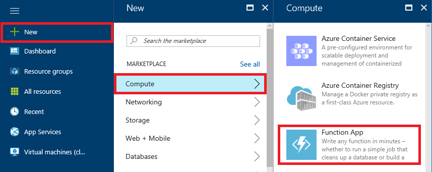

    _Criando um Azure Function App_

1. Digite um nome de aplicativo exclusivo no Azure. Em **Grupo de recursos**, selecione **Criar novo** e digite &quot;FunctionsLabResourceGroup&quot; (sem aspas) como o nome do grupo de recursos para criar um grupo de recursos para o Azure Function App. Escolha a **região** mais próxima e aceite os valores padrão para todos os outros parâmetros. Em seguida, clique em **Criar** para criar uma nova Aplicação de Função.

    > O nome do aplicativo passa a ser parte de um nome DNS e, portanto, deve ser exclusivo no Azure. Certifique-se de que uma marca de verificação verde aparece ao nome, indicando que ela é única. Você provavelmente **não** poderá usar &quot;functionslab&quot; como o nome do aplicativo.

    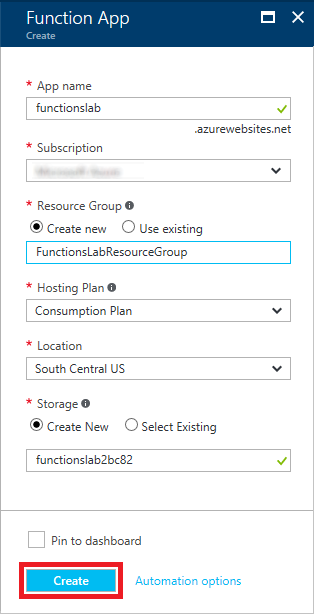

    _Criando uma Aplicação de Função_

1. Clique em **Grupos de recursos** na faixa de opções no lado esquerdo do portal e, em seguida, clique no grupo de recursos criado para o aplicativo Função.

    

    _Abrindo o grupo de recursos_

1. Clique periodicamente no botão **Atualizar** na parte superior da lâmina até &quot;o status da Implantação&quot; mude para &quot;Sucesso&quot;, indicando que o Azure Function App foi implantado. Em seguida, clique na conta de armazenamento que foi criada para o Azure Function App.

    

    _Abrindo a conta de armazenamento_

1. Clique em **Blobs** para ver o conteúdo do armazenamento blob.

    

    _Abertura blob armazenamento_

1. Clique em **+ container**. Digite &quot;carregado&quot; na caixa **Nome** e defina o **nível de acesso público** como **privado**. Em seguida, clique no botão **OK** para criar um novo contêiner.

    

    _Adicionando um container_

1. Repita a Etapa 7 para adicionar containers denominados &quot;aceitos&quot; e &quot;rejeitados&quot; para bloquear o armazenamento.
1. Confirme se os três containers foram adicionados ao armazenamento blob.

    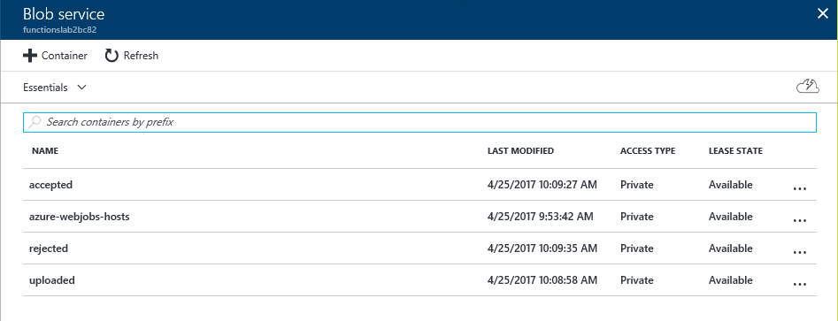

    _Os novos containers_

 Azure Function App foi criada e você adicionou três contêineres à conta de armazenamento criada para ela. O próximo passo é adicionar uma Azure Function.

<a name="Exercise2"></a>

## Exercício 2: Adicionando uma Azure Function ##

Depois de criar um Azure Function App Azure, você pode adicionar Funções Azure a ele. Neste exercício, você adicionará uma função à Aplicação de Função que você criou no [Exercício 1](#Exercise1) e escreve o código C# que usa a [API de Visão de Computador](https://www.microsoft.com/cognitive-services/en-us/computer-vision-api) para analisar imagens adicionadas ao contêiner &quot;carregado&quot; para conteúdo adulto ou racista.

1. Retorne à lâmina para o grupo de recursos &quot;FunctionsLabResourceGroup&quot; e clique n Azure Function App que você criou no [Exercício 1](#Exercise1).

    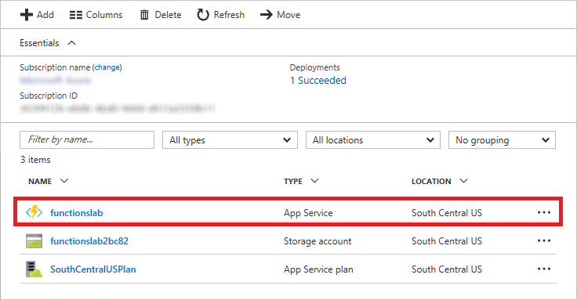

    _Abrindo a Aplicação de Função_

1. Clique no sinal **+** à direita das **Funções**. Defina o idioma para **CSharp** e, em seguida, clique em **Função personalizada**.

    

    _Adicionando uma função_

1. Definir **Idioma** para **C#**. Em seguida, clique em **BlobTrigger - C#**.

    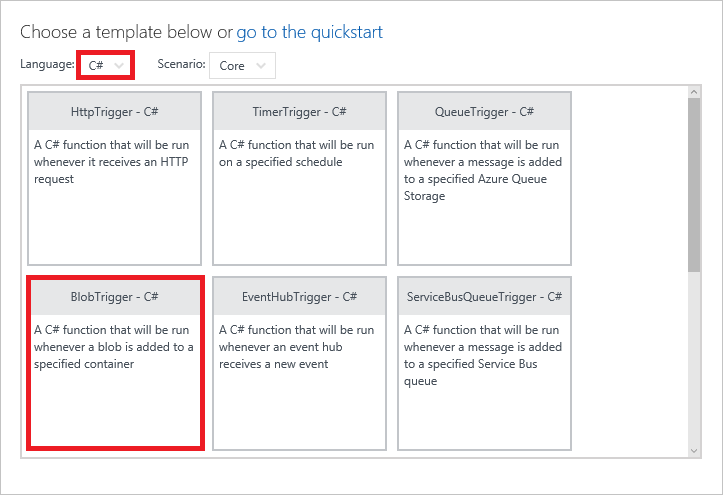

    _Selecionando um modelo de função_

1. Digite &quot;BlobImageAnalysis&quot; (sem aspas) para o nome da função e &quot;uploaded / {name}&quot; na caixa **Path**. (O último aplica o trigger de armazenamento blob ao contêiner &quot;carregado&quot; que você criou no Exercício 1.) Em seguida, clique no botão **Criar** para criar a Azure Function.

    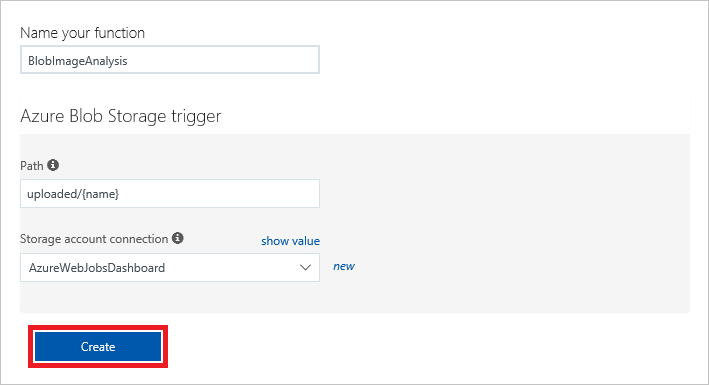

    _Criando uma Azure Function_

1. Substitua o código mostrado no editor de código com as seguintes instruções:

```C#

    using Microsoft.WindowsAzure.Storage.Blob;
    using Microsoft.WindowsAzure.Storage;
    using System.Net.Http.Headers;
    using System.Configuration;

    public async static Task Run(Stream myBlob, string name, TraceWriter og)
    {
        log.Info($"Analyzing uploaded image {name} for adult content...");

        var array = await ToByteArrayAsync(myBlob);
        var result = await AnalyzeImageAsync(array, log);

        log.Info("Is Adult: " + result.adult.isAdultContent.ToString());
        log.Info("Adult Score: " + result.adult.adultScore.ToString());
        log.Info("Is Racy: " + result.adult.isRacyContent.ToString());
        log.Info("Racy Score: " + result.adult.racyScore.ToString());

        if (result.adult.isAdultContent || result.adult.isRacyContent)
        {
            // Copy blob to the "rejected" container
            StoreBlobWithMetadata(myBlob, "rejected", name, result, log);
        }
        else
        {
            // Copy blob to the "accepted" container
            StoreBlobWithMetadata(myBlob, "accepted", name, result, log);
        }
    }

    private async static Task<ImageAnalysisInfo> AnalyzeImageAsync(byte[] ytes, TraceWriter log)
    {
        HttpClient client = new HttpClient();

        var key = ConfigurationManager.AppSettings["SubscriptionKey"];
        client.DefaultRequestHeaders.Add("Ocp-Apim-Subscription-Key", key);

        HttpContent payload = new ByteArrayContent(bytes);
        payload.Headers.ContentType = new MediaTypeWithQualityHeaderValue("application/octet-stream");

        var endpoint = ConfigurationManager.AppSettings["VisionEndpoint"];
        var results = await client.PostAsync(endpoint + "/analyze?visualFeatures=Adult", payload);
        var result = await results.Content.ReadAsAsync<ImageAnalysisInfo>();
        return result;
    }

    // Writes a blob to a specified container and stores metadata with it
    private static void StoreBlobWithMetadata(Stream image, string containerName, string blobName, ImageAnalysisInfo info, TraceWriter og)
    {
        log.Info($"Writing blob and metadata to {containerName} container...");

        var connection = ConfigurationManager.AppSettings["AzureWebJobsStorage"].ToString();
        var account = CloudStorageAccount.Parse(connection);
        var client = account.CreateCloudBlobClient();
        var container = client.GetContainerReference(containerName);

        try
        {
            var blob = container.GetBlockBlobReference(blobName);

            if (blob != null)
            {
                // Upload the blob
                blob.UploadFromStream(image);

                // Get the blob attributes
                blob.FetchAttributes();

                // Write the blob metadata
                blob.Metadata["isAdultContent"] = info.adult.isAdultContent.ToString();
                blob.Metadata["adultScore"] = info.adult.adultScore.ToString("P0").Replace(" ","");
                blob.Metadata["isRacyContent"] = info.adult.isRacyContent.ToString();
                blob.Metadata["racyScore"] = info.adult.racyScore.ToString("P0").Replace(" ","");

                // Save the blob metadata
                blob.SetMetadata();
            }
        }
        catch (Exception ex)
        {
            log.Info(ex.Message);
        }
    }

    // Converts a stream to a byte array
    private async static Task<byte[]> ToByteArrayAsync(Stream stream)
    {
        Int32 length = stream.Length > Int32.MaxValue ? Int32.MaxValue : Convert.ToInt32(stream.Length);
        byte[] buffer = new Byte[length];
        await stream.ReadAsync(buffer, 0, length);
        stream.Position = 0;
        return buffer;
    }

    public class ImageAnalysisInfo
    {
        public Adult adult { get; set; }
        public string requestId { get; set; }
    }

    public class Adult
    {
        public bool isAdultContent { get; set; }
        public bool isRacyContent { get; set; }
        public float adultScore { get; set; }
        public float racyScore { get; set; }
    }

```

Run é o método chamado cada vez que a função é executada. O método Run usa um método helper chamado AnalyzeImageAsync para passar cada blob adicionado ao container &quot;carregado&quot; para a API Computer Vision para análise. Em seguida, ele chama um método auxiliar chamado StoreBlobWithMetadata para criar uma cópia do blob no container &quot;aceito&quot; ou no container &quot;rejeitado&quot;, dependendo das pontuações retornadas AnalyzeImageAsync.

1. Clique no botão **Salvar** na parte superior do editor de código para salvar suas alterações. Em seguida, clique em **Exibir arquivos**.

    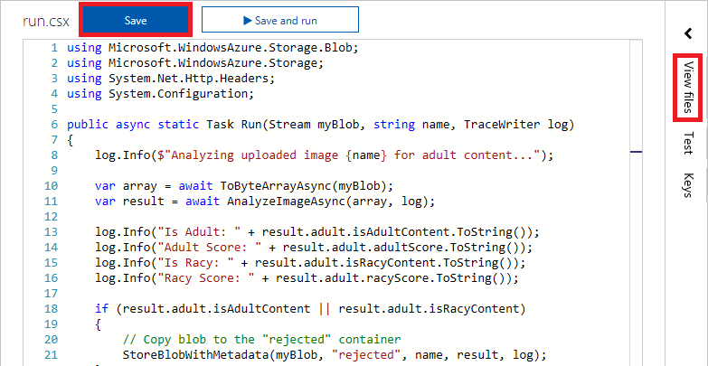

    _Salvando a função_

1. Clique em **+ Adicionar** para adicionar um novo arquivo e nomeie o arquivo **project.json**.

    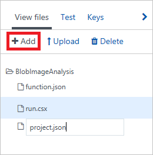

    _Adicionando um arquivo de projeto_

1. Adicione as seguintes declarações ao **project.json** :

```json

{
    "frameworks": {
        "net46": {
            "dependencies": {
                "WindowsAzure.Storage": "7.2.0"
            }
        }
    }
}

```

1. Clique no botão **Salvar** para salvar suas alterações. Em seguida, clique em **executar.csx** para voltar a esse arquivo no editor de código.

    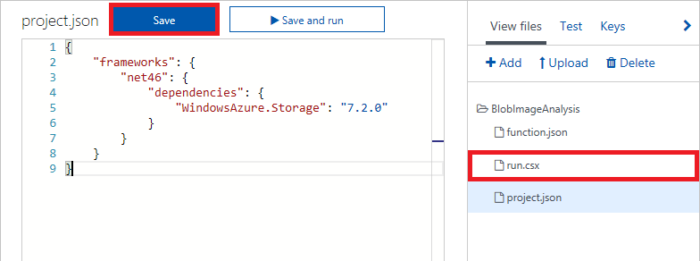

    _Salvando o arquivo do projeto_

Foi criada uma Azure Function escrita em C#, com um arquivo de projeto JSON contendo informações sobre dependências de projetos. O próximo passo é adicionar uma configuração de aplicativo em que a Azure Function se baseia.

<a name="Exercise3"></a>

## Exercício 3: Adicionando uma chave de inscrição às configurações do aplicativo ##

A Azure Function que você criou no [Exercício 2](#Exercise2) carrega uma chave de assinatura para a API de visão de computador do Microsoft Cognitive Services a partir das configurações do aplicativo. Essa chave é necessária para que seu código chame a API Computer Vision e seja transmitido em um cabeçalho HTTP em cada chamada. Ele também carrega o URL de base para a API Computer Vision (que varia de acordo com o centro de dados) das configurações do aplicativo. Neste exercício, você se inscreverá na API de Visão de Computador e, em seguida, adicionará uma chave de acesso e um URL de base às configurações do aplicativo.

1. No Portal Azure, clique em **+ Novo**, seguido por **AI + Cognitive Services** e **Computer Vision API**.

    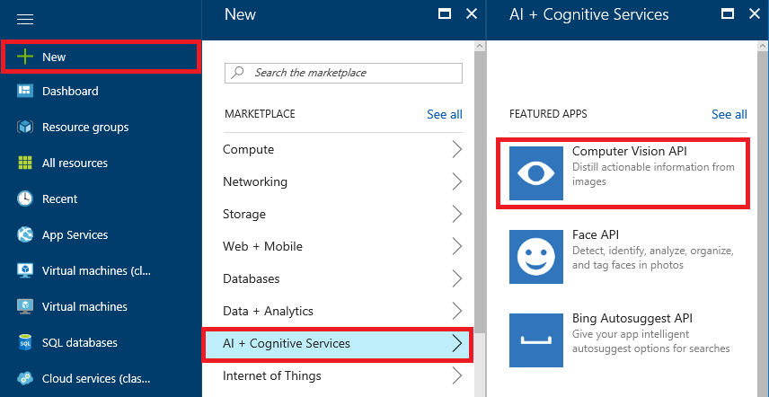

    _Criando uma nova assinatura da API Computer Vision_

1. Digite &quot;VisionAPI&quot; na caixa **Nome** e selecione **F0** como **Nível de Preços**. Em **Grupo de Recursos**, selecione **Usar existente** e selecione o grupo de recursos &quot;FunctionsLabResourceGroup&quot; que você criou para a Aplicação de Função no Exercício 1. Marque a caixa **Confirmar** e, em seguida, clique em **Criar**.

    

    _Inscrevendo-se na API Computer Vision_

1. Retorne à lâmina para &quot;FunctionsLabResourceGroup&quot; e clique na assinatura da API Computer Vision que você acabou de criar.

    

    _Abrindo a assinatura da API Computer Vision_

1. Copie o URL em **Endpoint** para o seu editor de texto favorito para que você possa recuperá-lo facilmente em um momento. Em seguida, clique em **Mostrar chaves de acesso**.

    

    _Visualizando as teclas de acesso_

1. Clique no botão **Copiar** à direita da **CHAVE 1** para copiar a tecla de acesso para a área de transferência.

    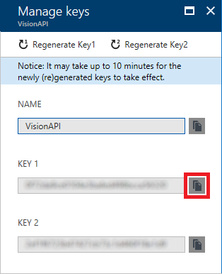

    _Copiando a chave de acesso_

1. Retorne à Aplicação de Função no Portal Azure e clique no nome do aplicativo na faixa à esquerda. Em seguida, clique em **Configurações do aplicativo**.

    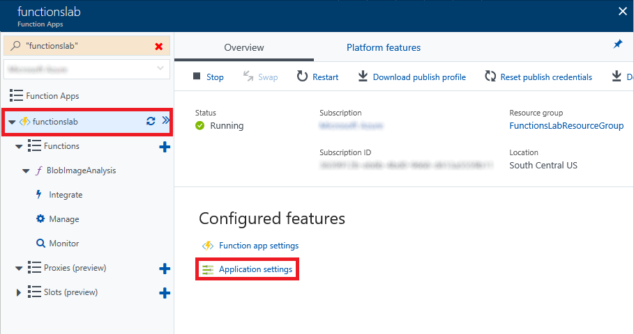

    _Visualizando as configurações do aplicativo_

1. Desça até a seção &quot;Configurações do aplicativo&quot;. Adicione uma nova configuração de aplicativo chamada &quot;Inscrição&quot; (sem aspas) e cole a chave de assinatura que está na área de transferência na caixa **Valor**. Em seguida, adicione uma configuração chamada &quot;VisionEndpoint&quot; e defina seu valor para o URL do nó de extremidade que você salvou na Etapa 4. Finalize clicando em **Salvar** na parte superior da lâmina.

    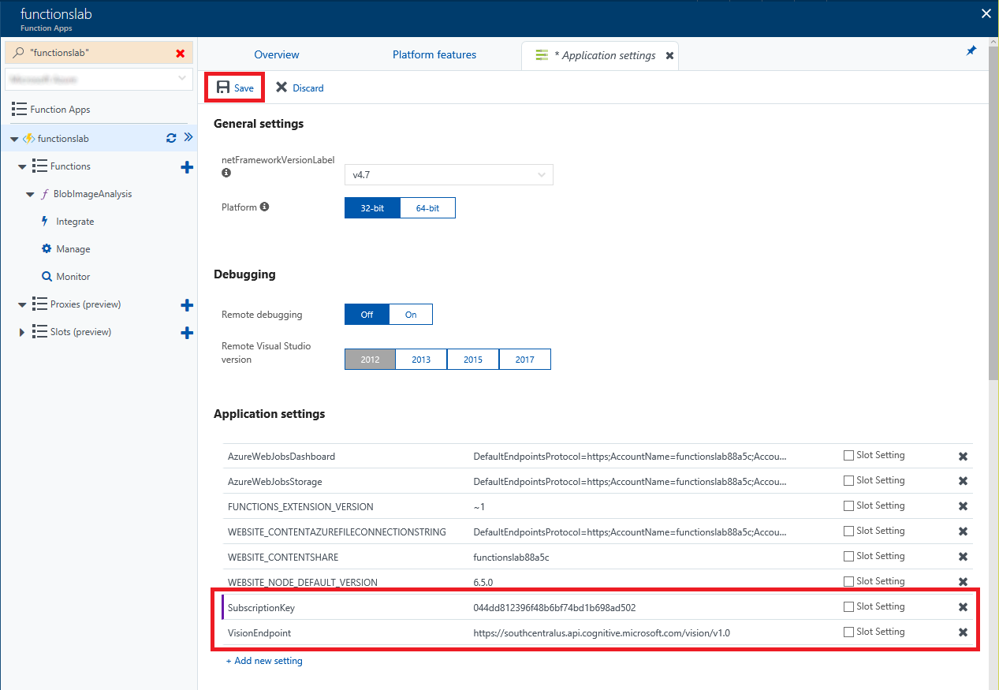

    _Adicionando configurações do aplicativo_

1. As configurações do aplicativo agora estão configuradas para sua Azure Function. É uma boa ideia validar essas configurações executando a função e garantindo que compila sem erros. Clique em **BlobImageAnalysis**. Em seguida, clique em **Executar** para compilar e executar a função. Confirme se nenhum erro de compilação aparece no log de saída e ignora quaisquer exceções relatadas.

    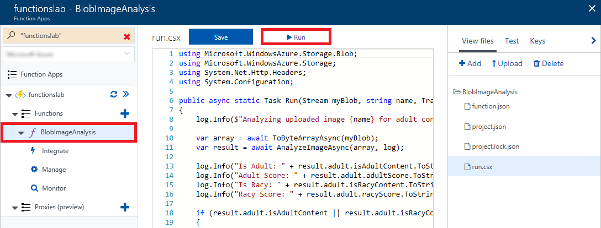

    _Compilando a função_

O trabalho de escrever e configurar a Azure Function está completo. Agora vem a parte divertida: testando.

<a name="Exercise4"></a>

## Exercício 4: Testando a Azure Function ##

Sua função está configurada para ouvir as alterações no contêiner blob chamado &quot;uploaded&quot; que você criou no [Exercício 1](#Exercise1). Cada vez que uma imagem aparece no container, a função executa e passa a imagem para a API de Visão de Computador para análise. Para testar a função, você simplesmente carrega imagens para o contêiner. Neste exercício, você usará o Portal Azure para carregar imagens no container &quot;carregado&quot; e verificará se as cópias das imagens são colocadas nos contêineres &quot;aceitos&quot; e &quot;rejeitados&quot;.

1. No Portal Azure, vá para o grupo de recursos criado para sua Aplicação de Função. Em seguida, clique na conta de armazenamento que foi criada para isso.

    

    _Abrindo a conta de armazenamento_

1. Clique em **Blobs** para ver o conteúdo do armazenamento blob.

    

    _Abertura blob armazenamento_

1. Clique **carregado** para abrir o contêiner &quot;carregado&quot;.

    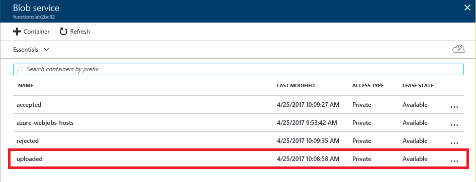

    _Abrindo o container &quot;carregado&quot;_

1. Clique em **Carregar**.

    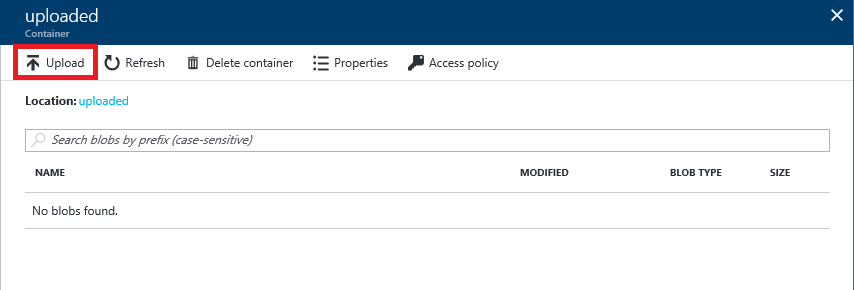

    _Fazendo o upload de imagens para o container &quot;carregado&quot;_

1. Clique no botão com o ícone da pasta à direita da caixa de **arquivos**. Selecione todos os arquivos na pasta &quot;Recursos&quot; deste laboratório. Em seguida, clique no botão **Carregar** para carregar os arquivos no container &quot;carregado&quot;.

    

    _Fazendo o upload de imagens para o container &quot;carregado&quot;_

1. Retorne à lâmina para o container &quot;carregado&quot; e verifique se foram carregadas oito imagens.

    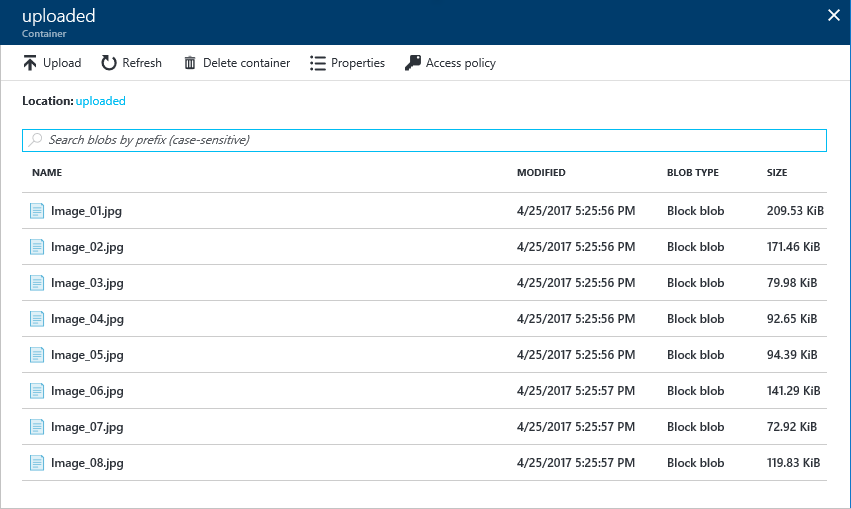

    _Imagens carregadas para o contentor &quot;carregado&quot;_

1. Feche a lâmina para o container &quot;carregado&quot; e abra o container &quot;aceito&quot;.

    

    _Abrindo o container &quot;aceito&quot;_

1. Verifique se o container &quot;aceito&quot; contém sete imagens. **Estas são as imagens que foram classificadas como nem adulta nem raça pela API Computer Vision**.

    > Como você escolheu &quot;Plano de Consumo&quot; ao criar a Aplicação de Função, pode levar alguns minutos para que todas as imagens apareçam no contêiner. Se necessário, clique em **Atualizar** periodicamente até ver todas as sete imagens.

    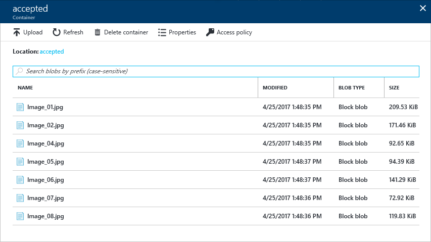

    _Imagens no container &quot;aceito&quot;_

1. Feche a lâmina para o container &quot;aceito&quot; e abra a lâmina para o container &quot;rejeitado&quot;. Verifique se o container &quot;rejeitado&quot; contém uma imagem. **Esta imagem foi classificada como adulto ou racy (ou ambos) pela API Computer Vision**.

    

    _Imagens no container &quot;rejeitado&quot;_

A presença de sete imagens no container &quot;aceito&quot; e um no container &quot;rejeitado&quot; é prova de que sua Azure Function executada sempre que uma imagem foi carregada no container &quot;carregado&quot;. Se você quiser, volte para a função BlobImageAnalysis no portal e clique em **Monitor**. Você verá um registro detalhando cada vez que a função for executada.

<a name="Exercise5"></a>

## Exercício 5: Exibindo metadados de blob (opcional) ##

E se você quiser ver as pontuações para conteúdo adulto e racista retornado pela API Computer Vision para cada imagem carregada no container &quot;carregado&quot;? As pontuações são armazenadas em metadados blob para as imagens nos contêineres &quot;aceitos&quot; e &quot;rejeitados&quot;, mas os metadados blob não podem ser vistos através do Portal Azure.

Neste exercício, você usará o [Microsoft Azure Storage Explorer de](http://storageexplorer.com/) plataforma cruzada para ver os metadados do blob e verá como a API da Computer Vision marcou as imagens que você carregou.

1. Se você não instalou o Microsoft Azure Storage Explorer, vá para [http://storageexplorer.com](http://storageexplorer.com/) e instale-o agora. Versões disponíveis para Windows, MacOS e Linux.

1. Inicie o Storage Explorer. Se você for solicitado a fazer login, faça isso usando a mesma conta que você usou para fazer login no Portal Azure.

1. Encontre a conta de armazenamento que foi criada para a su Azure Function App no [Exercício 1](#Exercise1) e expanda a lista de contêineres de blob embaixo dela. Em seguida, clique no container denominado &quot;rejeitado&quot;.

    

    _Abrindo o container &quot;rejeitado&quot;_

1. Clique com o botão direito do mouse (em um Mac, Comando-clique) na imagem no container &quot;rejeitado&quot; e selecione **Propriedades** no menu de contexto.

    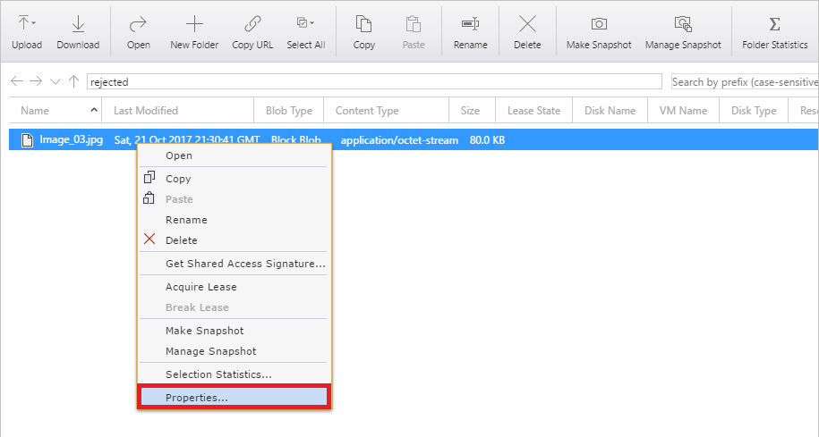

    _Exibindo metadados de blob_

1. Inspecione os metadados do blob. _IsAdultContent_ e _isRacyContent_ são valores booleanos que indicam se a API Computer Vision detectou conteúdo adulto ou racista na imagem. _Adultcore_ e _racyScore_ são as probabilidades calculadas.

    

    _Pontuações retornadas pela API Computer Vision_

1. Abra o container &quot;aceito&quot; e inspecione os metadados para algumas das bolhas armazenadas lá. Como esses valores de metadados são diferentes dos anexados ao blob no container &quot;rejeitado&quot;?

Você provavelmente pode imaginar como isso pode ser usado no mundo real. Suponha que você estivesse construindo um site de compartilhamento de fotos e queria evitar que as imagens adultas fossem armazenadas. Você poderia facilmente escrever uma Azure Function que inspeciona cada imagem carregada e exclui-a do armazenamento se contiver conteúdo adulto.

<a name="Summary"></a>

## Resumo ##

Neste laboratório prático, você aprendeu a:

- Criar um Azure Function App
- Escreva uma Azure Function que usa um trigger blob
- Adicionar configurações de aplicativo a um Azure Function App
- Use o Microsoft Cognitive Services para analisar imagens e armazenar os resultados em metadados blob

Este é apenas um exemplo de como você pode aproveitar as Funções Azure para automatizar tarefas repetitivas. Experimente com outros modelos de Azure Function para aprender mais sobre as Funções do Azure e para identificar formas adicionais nas quais eles podem auxiliar sua pesquisa ou negócios.

Copyright 2017 Microsoft Corporation. Todos os direitos reservados. Exceto quando indicado de outra forma, esses materiais são licenciados sob os termos da Licença MIT. Você pode usá-los de acordo com a licença, conforme apropriado para o seu projeto. Os termos desta licença podem ser encontrados em [https://opensource.org/licenses/MIT](https://opensource.org/licenses/MIT).