# Hands-on Lab #3 - C# #

## Visão geral

City Power &amp; Light é um exemplo de aplicação que permite aos cidadãos denunciar &quot;incidentes&quot; que ocorreram em sua comunidade. Inclui uma tela inicial, um painel de controle e um formulário para relatar novos incidentes com uma foto opcional. O aplicativo é implementado com vários componentes:

* O aplicativo front-end web contém a interface do usuário e a lógica do negócio. Este componente foi implementado três vezes em .NET, NodeJS e Java.
* O WebAPI é compartilhado em ambas as front-ends e expõe o back-end para o CosmosDB.
* CosmosDB é usado como a camada de persistência de dados.

Neste laboratório, você continuará aprimorando a experiência geral da City Power &amp; Light criando um relatório de incidentes a partir do zero e através do serviço Azure Bot e hospedá-lo no Azure. O bot poderá reunir dados de um usuário com uma foto opcional e enviá-lo para o WebAPI.

> *** O desenvolvimento de bots atualmente é suportado apenas em C# e NodeJS. Neste exercício, demonstraremos principalmente a criação e implantação de bots que é independente da linguagem de programação usada e de diferentes recursos de bot. O bot na verdade será criado pelo uso extensivo do modelo [FormFlow] (https://docs.microsoft.com/en-us/bot-framework/dotnet/bot-builder-dotnet-formflow) em C#. As alterações ao código são mínimas e não requerem a compreensão real da linguagem C#. É importante ver como o template é aplicado. ***

## Objetivos

Neste laboratório prático, você aprenderá como:

* Configurar o ambiente em desenvolvimento para apoiar a criação de aplicativos de bot.
* Criar seu próprio bot a partir do zero.
* Criar seu próprio bot usando o serviço Azure Bot.
* Hospedandar seu bot em Azure.

## Pré-requisitos

* O código fonte do aplicativo inicial está localizada na pasta [inicial](https://github.com/AzureCAT-GSI/DevCamp/blob/master/HOL/dotnet/07-bot/start).
* O projeto concluído está localizado na pasta [final](https://github.com/AzureCAT-GSI/DevCamp/blob/master/HOL/dotnet/07-bot/end).
* Projeto inicial ARM Template implantado [HOL 1](https://github.com/AzureCAT-GSI/DevCamp/blob/master/HOL/dotnet/01-developer-environment).
* Conclusão do [HOL 5](https://github.com/AzureCAT-GSI/DevCamp/blob/master/HOL/dotnet/05-arm-cd).

## Exercícios

Este hands-on-lab tem os seguintes exercícios:

* [Exercício 1: configure seu ambiente](#ex1)
* [Exercício 2: Crie um diálogo interativo](#ex2)
* [Exercício 3: integrar a API](#ex3)
* [Exercício 4: Enviar anexos ao bot](#ex4)
* [Exercício 5: Hospede seu bot em Azure](#ex5)
* [Exercício 6: Serviço Azure Bot](#ex6)

## Exercício 1: configure seu ambiente<a name="ex1"></a>

Visite nosso tutorial de configuração de ambiente [neste link](https://github.com/CommunityBootcamp/Maratona-BOTs/tree/master/QuickStart)


## Exercício 2: Crie um diálogo interativo<a name="ex2"></a>

Estamos usando o template  [FormFlow](https://docs.microsoft.com/en-us/bot-framework/dotnet/bot-builder-dotnet-formflow) para criar o nosso bot. O template permite que você defina uma série de propriedades, incluindo aquelas baseadas em enums, que o bot irá reunir automaticamente do usuário. Podemos até mesmo modificar o texto que o bot usa para solicitar ao usuário e simplesmente adicionar expressões regulares que são verificadas pelo bot.

1. Abra o Visual Studio e carregue o projeto `CityPowerBot.sln` da pasta start.

1. Abra o arquivo `CityPowerBot` -> `Dialogs` -> `BasicForm.cs` e adicione o seguinte código que criará uma propriedade para cada valor do nosso relatório de incidente. Também permitirá que o bot se apresente e cumprimente o usuário com seu próprio nome. A ordem da interacção é determinada pelo `FormBuilder` no método `BuildForm`.

    ```csharp
    using Microsoft.Bot.Builder.Dialogs;
    using Microsoft.Bot.Builder.FormFlow;
    using Microsoft.Bot.Builder.FormFlow.Advanced;
    using System;
    using System.Collections.Concurrent;
    using System.Collections.Generic;
    using System.Globalization;
    using System.IO;
    using System.Linq;
    using System.Reflection;
    using System.Threading;
    #pragma warning disable 649

    namespace CityPowerBot
    {
        public enum IncidentTypes { GasLeak = 1, StreetLightStaysOn };

        // For more information about this template visit http://aka.ms/azurebots-csharp-form
        [Serializable]
        public class BasicForm
        {
            [Prompt("What is your {&}?")]
            public string FirstName { get; set; }

            [Prompt("And your {&}?")]
            public string LastName { get; set; }

            [Prompt("What type of outage would you like to report? {||}")]
            public IncidentTypes IncidentType { get; set; }

            [Prompt("Is this issue an {&}? {||}")]
            public bool Emergency { get; set; }

            [Prompt("Please give a {&} of the problem.")]
            public string Description { get; set; }

            [Pattern(@"(<Undefined control sequence>\d)?\s*\d{3}(-|\s*)\d{4}")]
            [Prompt("What is the {&} where we can currently reach you?")]
            public string PhoneNumber { get; set; }

            [Prompt("In which {&} do you live?")]
            public string City { get; set; }

            [Prompt("And in which state {&}?")]
            public string State { get; set; }

            [Prompt("Lastly, what {&} do you live on?")]
            public string Street { get; set; }

            [Pattern(@"^\d{5}(?:[-\s]\d{4})?$")]
            [Prompt("What is your {&}?")]
            public string ZipCode { get; set; }

            public static IForm<BasicForm> BuildForm()
            {
                // Builds an IForm<T> based on BasicForm
                return new FormBuilder<BasicForm>()
                    .Message("I am the City Power Bot! You can file a new incident report with me :-)")
                    .Field(nameof(FirstName))
                    .Field(nameof(LastName))
                    .Message("Hello {FirstName} {LastName}! Let's file your report!")
                    .Field(nameof(Emergency))
                    .Field(nameof(IncidentType))
                    .Field(nameof(Description))
                    .Field(nameof(City))
                    .Field(nameof(State))
                    .Field(nameof(ZipCode))
                    .Field(nameof(Street))
                    .Field(nameof(PhoneNumber))
                    .Build();
            }

            public static IFormDialog<BasicForm> BuildFormDialog(FormOptions options = FormOptions.PromptInStart)
            {
                // Generated a new FormDialog<T> based on IForm<BasicForm>
                return FormDialog.FromForm(BuildForm, options);
            }
        }
    }
    ```

Observe como podemos usar o `IncidentTypes` enum e a propriedade booleana `Emergency`. O `FormBuilder` transformará esses tipos automaticamente em escolhas apresentadas ao usuário. Duas expressões regulares verificam o formato das propriedades `PhoneNumber` e `ZipCode`.

1. Vamos testar o novo bot. Aperte `F5` para iniciar o processo de depuração. O Internet Explorer irá abrir e exibir informações do bot. Observe o endereço.

1. Inicie o `Bot Framework Emulator`.

1. A URL do endpoint deve ser o endereço do seu bot seguido por `/api/messages`. Deve ser semelhante a `http://localhost:3979/api/messages`. Visto que faremos uma depuração local, você pode ignorar as caixas de texto `Microsoft App ID`, `Microsoft App Passworde` e `Locale` e bastando clicar no botão `CONNECT`.

    

1. A seção `Log` no canto inferior direito informará você, que você agora está conectado ao seu bot.

1. Digite qualquer texto na janela de mensagem para iniciar a caixa de diálogo com o seu bot. Em seguida, começará a solicitar detalhes de incidentes.

    

1. Durante a sua interação que você pode usar palavras de comando como `back`, `quit`, `reset`, `status` e `help`.

    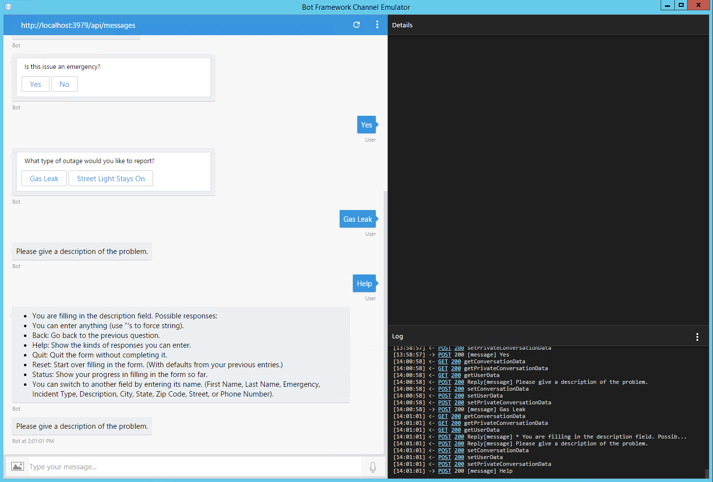

Você já criou um bot simples que reúne todos os dados que precisamos para um relatório de incidente do usuário usando o template  [FormFlow](https://docs.microsoft.com/en-us/bot-framework/dotnet/bot-builder-dotnet-formflow), que faz a maior parte do trabalho para você. Em seguida, você estenderá o bot para também aceitar uma imagem para o relatório.

## Exercício 3: Enviar anexos ao bot<a name="ex3"></a>

Você notou o botão de imagem ao lado da janela de mensagem? Você pode não apenas enviar mensagens de texto para o seu bot, mas também arquivos de imagem. Vamos dizer ao bot como lidar com eles.

1. No `CityPowerBot` -> `Controllers` -> `MessagesController.cs` substitua a criação do `MainDialog` com um switch que filtra as mensagens que contenham imagens, enquanto deixa o `MainDialog` existente lidar com todas as demais mensagens.

    ```csharp
    if (activity.Type == ActivityTypes.Message)
    {
        // Stores send images out of order.
        var connector = new ConnectorClient(new Uri(activity.ServiceUrl));
        var imageAttachment = activity.Attachments?.FirstOrDefault(a => a.ContentType.Contains("image"));
        if (imageAttachment != null)
        {
            LastImage = await GetImageStream(connector, imageAttachment);
            LastImageName = imageAttachment.Name;
            LastImageType = imageAttachment.ContentType;
            Activity reply = activity.CreateReply("Got your image!");
            await connector.Conversations.ReplyToActivityAsync(reply);
        }
        else
        {
            // Creates a dialog stack for the new conversation, adds MainDialog to the stack, and forwards all messages to the dialog stack.
            await Conversation.SendAsync(activity, () => new MainDialog());
        }
    }
    ```

1. Adicione estes dois métodos que irão extrair um fluxo da imagem enviada pelo usuário.

```csharp
    private static async Task<Stream> GetImageStream(ConnectorClient connector, Attachment imageAttachment)
    {
        using (var httpClient = new HttpClient())
        {
            // The Skype attachment URLs are secured by JwtToken,
            // you should set the JwtToken of your bot as the authorization header for the GET request your bot initiates to fetch the image.
            // https://github.com/Microsoft/BotBuilder/issues/662
            var uri = new Uri(imageAttachment.ContentUrl);
            if (uri.Host.EndsWith("skype.com") && uri.Scheme == "https")
            {
                httpClient.DefaultRequestHeaders.Authorization = new AuthenticationHeaderValue("Bearer", await GetTokenAsync(connector));
                httpClient.DefaultRequestHeaders.Accept.Add(new MediaTypeWithQualityHeaderValue("application/octet-stream"));
            }

            return await httpClient.GetStreamAsync(uri);
        }
    }

    /// <summary>
    /// Gets the JwT token of the bot.
    /// </summary>
    /// <param name="connector"></param>
    /// <returns>JwT token of the bot</returns>
    private static async Task<string> GetTokenAsync(ConnectorClient connector)
    {
        var credentials = connector.Credentials as MicrosoftAppCredentials;
        if (credentials != null)
        {
            return await credentials.GetTokenAsync();
        }

        return null;
    }
   ```

O código armazenará a última imagem enviada nas variáveis ​​a serem usadas quando o relatório for enviado.

1. Agora temos que dizer aos usuários que eles podem enviar imagens junto com seus relatórios de incidentes. Abra o `CityPowerBot`-> `Dialogs`-> `BasicForm.cs` e no método `BuildForm` adicione esta mensagem adicional logo após a primeira mensagem enviada pelo seu bot:

    ```csharp
    .Message("Did you know? At any point during our conversation you can send me an image that I will attach to your report.")
    ```

1. Aperte `F5` para iniciar o processo de depuração e falar com o seu bot através do `Bot Framework Emulator`. Observe que o bot está informando sobre sua nova capacidade. Durante a interação, clique no botão da imagem e mande uma imagem da sua máquina. O bot confirmará que &quot;obteve sua imagem&quot;.

    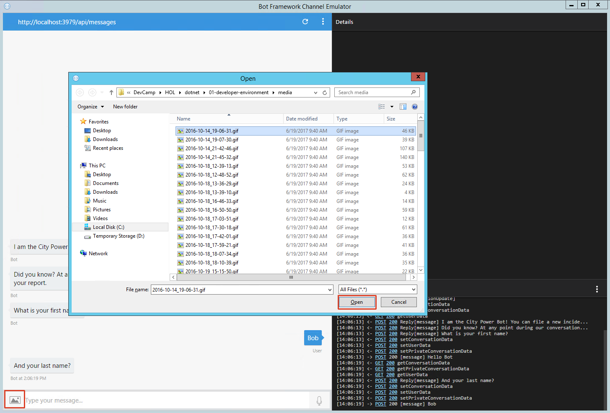

    A pasta DevCamp contém muitas imagens que você pode usar para testar o recurso.

    

Enviar a imagem não afetará o resto da sua conversa com o bot.

Seu bot agora aceita e armazena uma imagem enviada pelo usuário. Agora que você tem tudo o que pode ser enviado em um relatório de incidente, você irá enviá-lo para a API de incidente.

## Exercício 4: integrar a API<a name="ex4"></a>

Para arquivar o incidente informado, usamos a API de incidente. Os métodos necessários estão presentes no projeto `DataWriter`. O projeto contém excertos das mãos anteriores nos laboratórios. O código foi encurtado para apenas criar um incidente e fazer o upload da imagem anexada. Para completá-lo, você deve adicionar suas informações de conta Azure.

1. Abra o arquivo  `DataWriter` -> `IncidentController.cs` e substitua o valor `YOUR INCIDENT API URL` com o URL da sua API incidente que você marcou no  [exercício 1 do HOL 2](#ex1), semelhante a `http://incidentapi[...].azurewebsites.net`.

1. Abra o arquivo `DataWriter` -> `StorageHelper.cs` e substitua o valor `YOUR AZURE BLOB STORAGE` com o seu **Storage account name** e o valor `YOUR AZURE BLOB STORAGE ACCESS KEY` com a **key1** armazenada no [HOL 2 exercise 3](#ex3). Esses valores foram armazenados nas variaveis de ambiente do código do laboratório anterior.

1. Agora que o projeto `DataWriter` está preparado, iremos chamar seu método `Create` depois de termos todos os dados do usuário. Abra `CityPowerBot` -> `Dialogs` -> `BasicForm.cs` e adicione a seguinte decatacao `OnCompletionAsyncDelegate` no início do método `BuildForm` antes do `return`:

    ```csharp
    OnCompletionAsyncDelegate<BasicForm> processReport = async (context, state) =>
    {
        await context.PostAsync("We are currently processing your report. We will message you the status.");
        if (await DataWriter.IncidentController.CreateAsync(state.FirstName, state.LastName, state.Street, state.City, state.State, state.ZipCode, state.PhoneNumber, state.Description, state.IncidentType.ToString(), state.Emergency, MessagesController.LastImage, MessagesController.LastImageName, MessagesController.LastImageType))
        {
            await context.PostAsync("The incident report has been logged.");
        }
        else
        {
            await context.PostAsync("An error occured logging the incident.");
        }
    };
    ```

1. Vamos permitir que os usuários confirmem que querem enviar os dados inseridos usando o recurso de confirmação do template. Se o usuário responder com `No` a entrada pode ser alterado antes de ser enviado. Mais uma vez, o template  [FormFlow](https://docs.microsoft.com/en-us/bot-framework/dotnet/bot-builder-dotnet-formflow) faz todo o trabalho para você. Uma vez que recebemos a confirmação, podemos processar o relatório do incidente enviando-o para a API do incidente. Adicione as chamadas `Confirm` e `OnCompletion` para o final da cadeia do construtor de formulários antes da Build()chamada:

    ```csharp
    .Field(nameof(PhoneNumber))

    .Confirm(async (state) =>
    {
        return new PromptAttribute($"OK, we have got all your data. Would you like to send your incident report now?");
    })
    .OnCompletion(processReport)

    .Build();
    ```

1. Aperte `F5` para iniciar o processo de depuração e falar com o seu bot através do `Bot Framework Emulator`.
1. Responda todas as perguntas do bot e confirme que deseja enviar o relatório do incidente.

    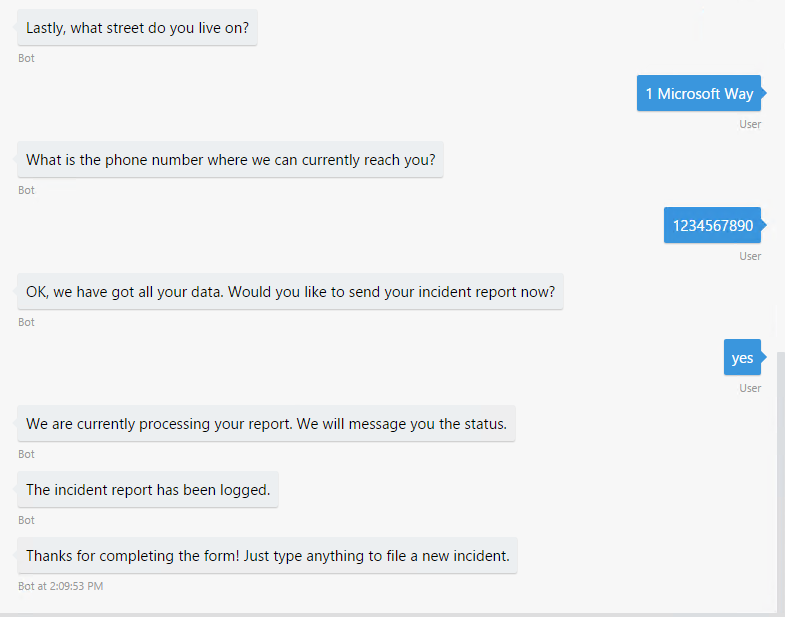

1. Em outra aba do navegador, abra o Painel do site do City Power que você implantou nos HoL anteriores para verificar se seu novo incidente foi registrado. Você também pode executar uma cópia local do seu código de outra instância do Visual Studio para executar o site do City Power.

    

1. Use o Azure Storage Explorer como fez no  [HOL 2 exercício 3](ex3) para verificar se a imagem que você anexou foi carregada no armazenamento blob. Você pode clicar duas vezes na imagem para abri-la em uma nova janela.

    

Seu bot está pronto. Ele reúne e faz upload de dados para criar um novo relatório de incidente. Em seguida, você irá implantá-lo no Azure para torná-lo globalmente acessível.

## Exercício 5: Hospede seu bot em Azure<a name="ex5"></a>

Para tornar nosso bot acessível, temos que publicá-lo em um local público. Um aplicativo Azure é ideal para isso. Vamos permitir que o Visual Studio faça a publicação e crie automaticamente um novo aplicativo Azure no nosso grupo de recursos para hospedar o bot. Uma vez que o assistente de publicação do Visual Studio tenha feito isso, registraremos o bot no  [Portal do Bot Framework](https://dev.botframework.com/bots) e adicionaremos os IDs gerados para o nosso Web.config.

1. Se o seu bot ainda estiver em execução, pare-o. No Solution Explorer, clique com o botão direito do mouse no projeto `CityPowerBot` e selecione `Publish`. Isso inicia o assistente de publicação do Microsoft Azure.

    

1. Selecione o `Microsoft Azure App Service` que abrirá a caixa de diálogo Serviço do aplicativo.

    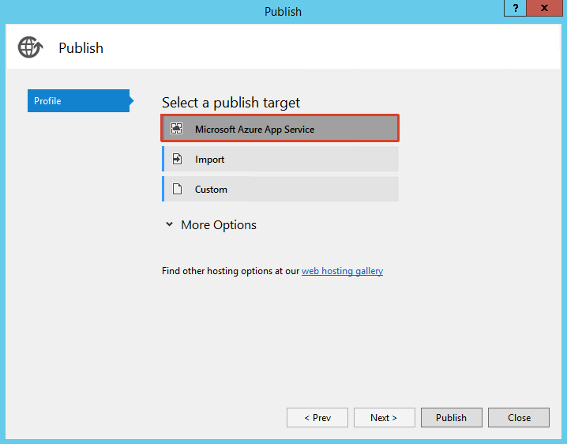

1. Selecione o grupo `DevCamp` de recursos e clique em `New...`.

    

1. Aceite os padrões e clique `Create`.

    

1. Observe o valor `Destination URL` (você precisará desse valor mais tarde para testar a conexão com o bot) e, em seguida, clique `Validat` e `Connection` para verificar se as configurações foram configuradas corretamente. Se a validação for bem-sucedida, clique em `Next`.

    

1. Por padrão, seu bot será publicado em uma configuração `Release`. (Se quiser depurar o seu bot, mude `Configuration` para `Debug`). Clique em `Publish` para publicar o seu bot para o Microsoft Azure.

    

1. Abra um navegador e navegue até o  [Portal](https://dev.botframework.com/bots) do  [Bot Framework](https://dev.botframework.com/bots) . Depois de iniciar sessão, clique em `Create`:

    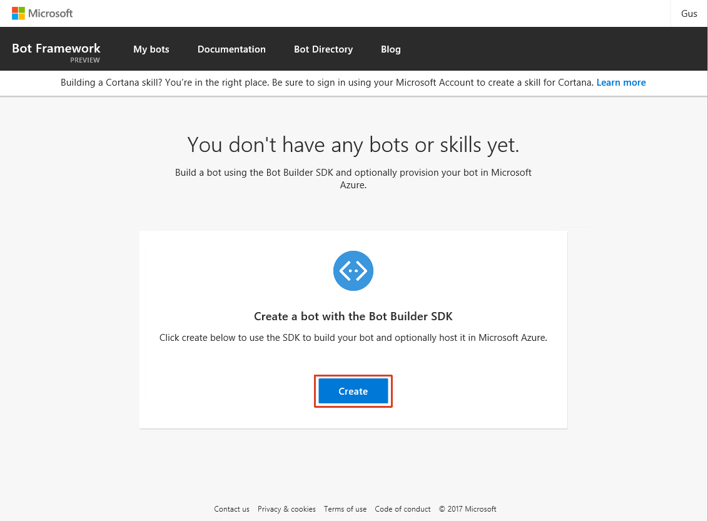

1. Na caixa de diálogo, selecione `Register an existing bot using Bot Builder SDK` e clique em `Ok`:

    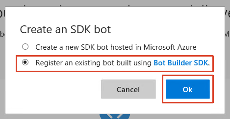

    **Complete a seção de perfil do formulário do formulário.**

    1. Opcionalmente, carregue um ícone que representará o seu bot na conversa.
    1. Forneça o `Display Name` do seu bot. Quando os usuários procuram este bot, este é o nome que aparecerá nos resultados da pesquisa.
    1. Forneça o `Handle` do seu bot . Esse valor será usado no URL do seu bot e não pode ser alterado após o registro.
    1. Forneça uma `Description` dos seus bot. Esta é a descrição que aparecerá nos resultados da pesquisa, por isso deve descrever com precisão o que o bot faz.

    **Complete a seção Configuração do formulário.**

    1. Forneça o ponto de extremidade de mensagens HTTPS do seu bot. Este é o ponto final onde o seu bot receberá mensagens POST HTTP do Conector de Bot. Use o que `Destination URL` que você anotou anteriormente e adicione `https` e `/api/messages`. Deve ficar semelhante a: `https://citypowerbot20170712104041.azurewebsites.net/api/messages`.

        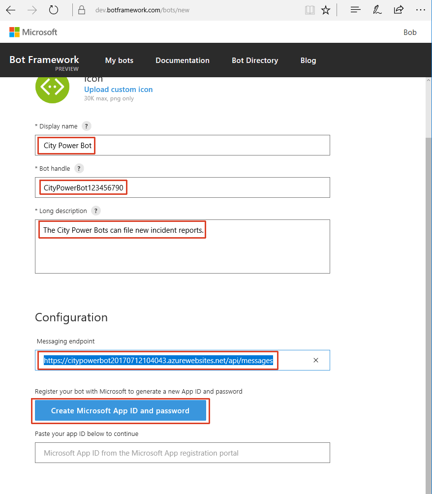

    1. Clique em `Create Microsoft App ID and password`.
        * Armazene o ID do aplicativo.
        * Na próxima página, clique em `Generate an app password to continue`.
        * Copie e armazene com segurança a senha que é mostrada, e então clique em `Ok`.
        * Clique em `Finish and go back to Bot Framework`.
        * De volta ao Portal do Bot Framework, o campo `App ID` já deve estar preenchido.

        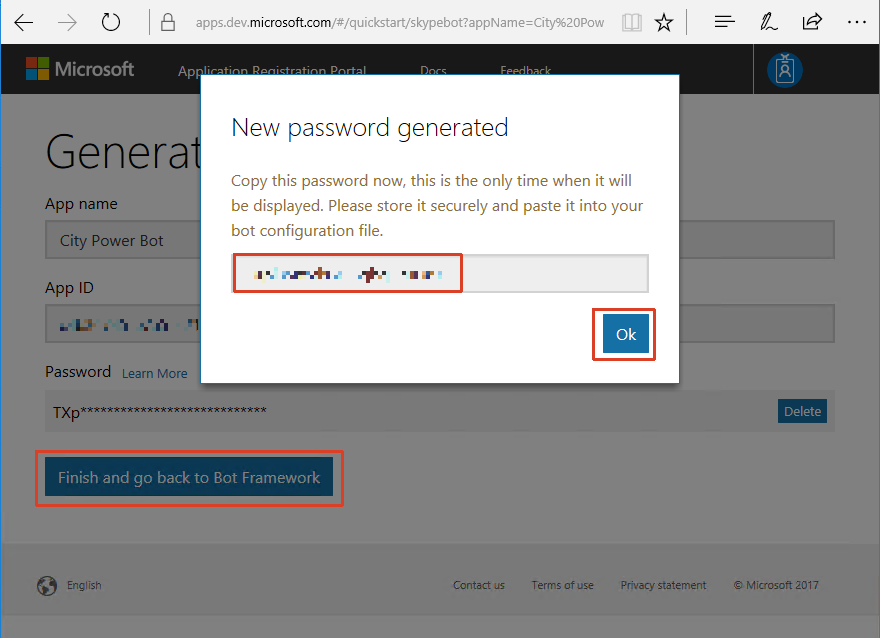

    **Complete a seção Admin do formulário.**

    1. Especifique o (s) endereço (s) de e-mail para o (s) Proprietário (s) do bot.

    1. Verifique se você leu e concorda com os Termos de Uso, Declaração de Privacidade e Código de Conduta.

    1. Clique em `Register` para completar o processo de registro.

        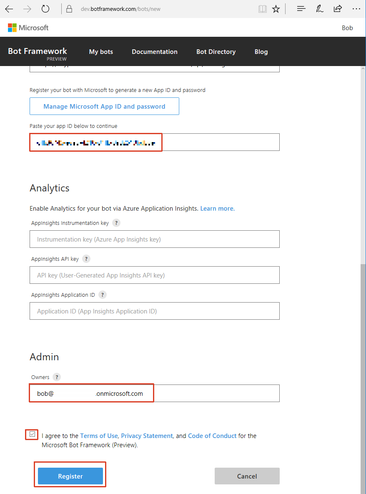

1. No Visual Studio, abra o `CityPowerBot` -> `web.config` e insira os valores que você acabou de reunir para o `BotId` (o bot `Handle` que você digitou durante o processo de registro) `MicrosoftAppId` e `MicrosoftAppPassword` na seção `appSettings`.

    ```charp
    <appSettings>
        <!-- update these with your BotId, Microsoft App Id and your Microsoft App Password-->
        <add key="BotId" value="YourBotId" />
        <add key="MicrosoftAppId" value="" />
        <add key="MicrosoftAppPassword" value="" />
    </appSettings>
    ```

1. No Solution Explorer, clique com o botão direito do mouse no projeto `CityPowerBot` e clique em `Publish`. Isso inicia o assistente de publicação do Microsoft Azure. Clique em `Publish` para publicar as alterações.

    

1. Teste a implantação do seu bot usando o `Bot Framework Emulator`. Você precisa configurar o `ngrok` para se conectar ao seu bot hoespedado no Azure. Clique nos três pontos e selecione `App Settings` para abrir a caixa de diálogo de configurações.

    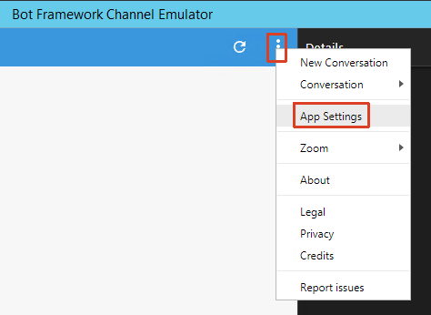

1. Na caixa de diálogo, selecione o arquivo `ngrok.exe` que você extraiu no seu desktop no primeiro exercício, verimarque a opção `Use version 1.0 authentication tokens` e clique `SAVE` para fechar a caixa de diálogo.

    

1. Digite o endpoint HTTPS do bot na barra de endereços do Emulador. Ele deve ser semelhante a este: `https://citypowerbot20170712104041.azurewebsites.net/api/messages`. Também forneça o `Microsoft App ID` e o `Microsoft App Password` que você marcou anteriormente. Em seguida, clique em `CONNECT`. Teste o seu bot como anteriormente.

    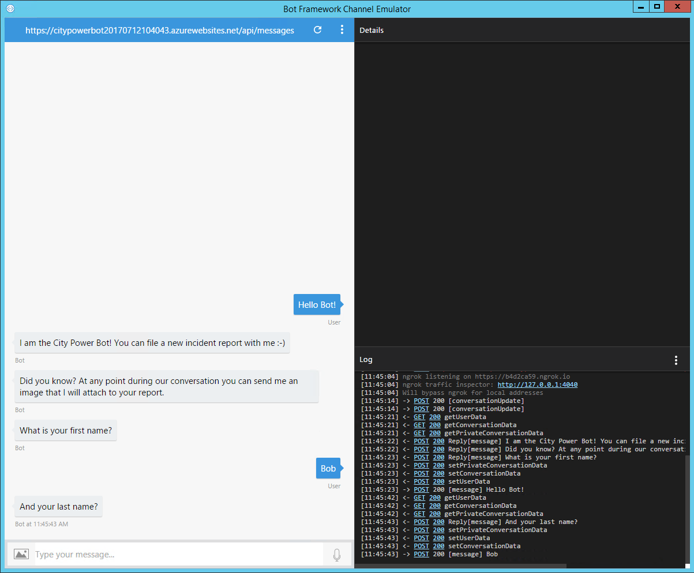

    > Se você receber uma mensagem de erro 500 do servidor, tente remover o `Microsoft App ID` e o `Microsoft App Password` e reconecte-se ao bot.

1. Se você desejar, agora pode  [configurar o bot](https://docs.microsoft.com/en-us/bot-framework/portal-configure-channels) para executar em um ou mais canais.

Agora você criou um bot manualmente e carregou-o no Azure. Uma maneira alternativa de criar um bot é usar o serviço Azure Bot.

## Exercício 6: Serviço Azure Bot<a name="ex6"></a>

Você já viu alguns dos fundamentos do desenvolvimento do bot. Nos exercícios, você usou o template  [FormFlow](https://docs.microsoft.com/en-us/bot-framework/dotnet/bot-builder-dotnet-formflow) para criar a interação entre o usuário e o bot. Muitos outros modelos estão disponíveis. Você também pode usar o  [Serviço Azure Bot](https://docs.microsoft.com/en-us/bot-framework/azure/azure-bot-service-overview) para criar rapidamente um bot a partir do portal Azure.

1. Para criar um bot usando o Serviço Azure Bot, navegue até o grupo de recursos `DevCamp` e clique em `Add`. Digite `Bot Service` na caixa do filtro, depois selecione `Bot Service (Preview)` e clique em `Create` na lâmina de detalhes.

    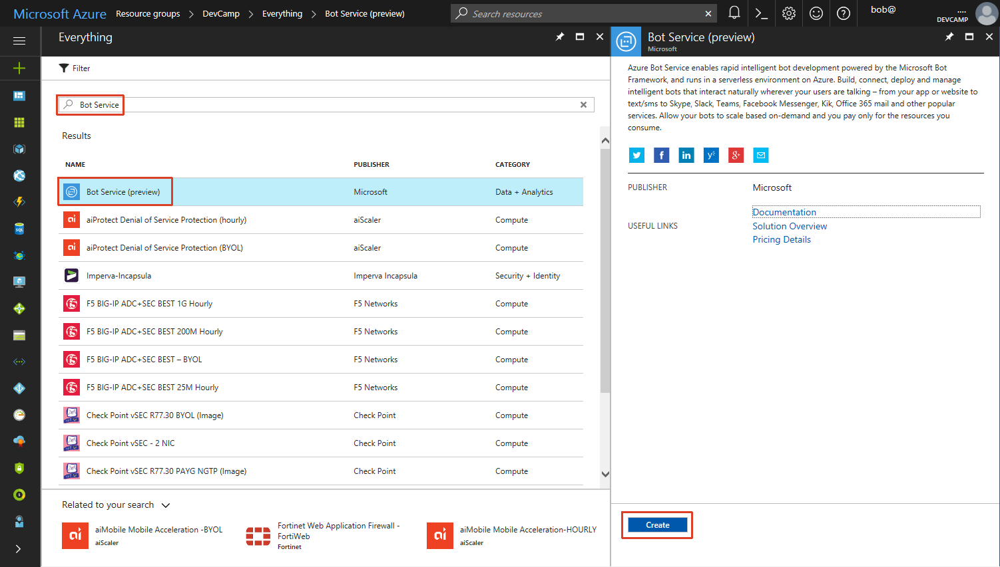

1. Digite um nome para o seu bot e clique Create

    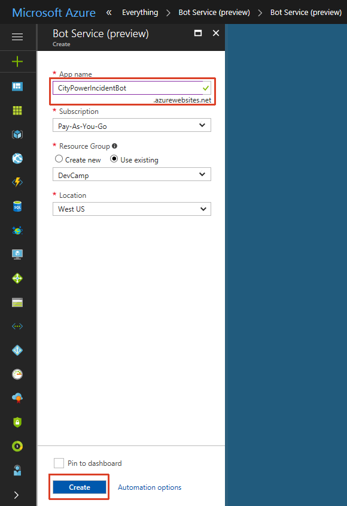

1. Navegue até o bot no seu grupo de recursos. Você será redirecionado para a lâmina do template. Agora, você pode selecionar sua linguagem de programação preferida e o template que deseja usar para o seu bot. Escolha `Form` para terminar com um bot que é novamente baseado no template  [FormFlow](https://docs.microsoft.com/en-us/bot-framework/dotnet/bot-builder-dotnet-formflow) e clique em `Next`.

    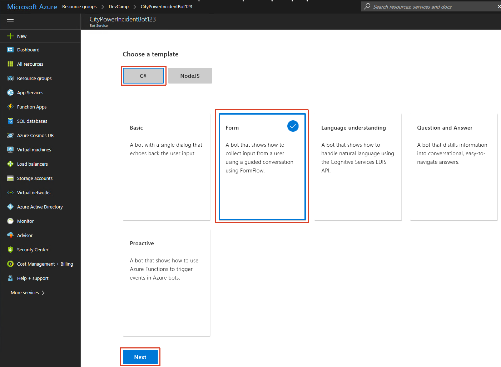

1. Clique `Manage Microsoft App ID and password` e crie um novo id para o seu bot. Copie o Id do aplicativo e a senha para a lâmina do template, verifique e aceite os Termos de Uso e clique em `Create bot`.

    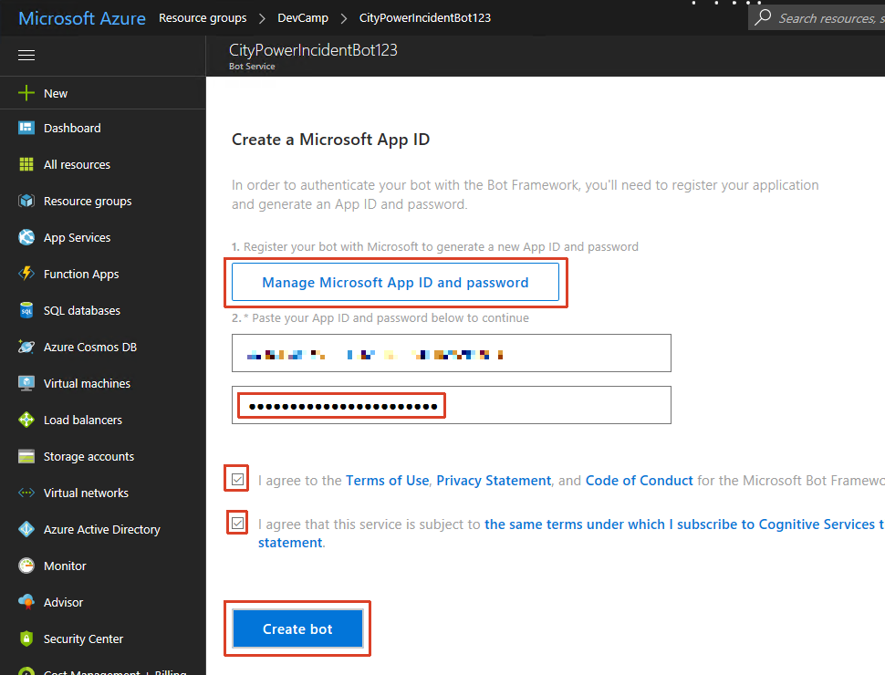

1. A implantação levará alguns minutos.

    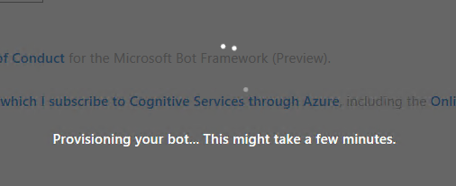

1. Você pode encontrar mais informações sobre os modelos e sua aplicação  [aqui](https://docs.microsoft.com/en-us/bot-framework/azure/azure-bot-service-overview) .
1. Agora você pode desenvolver e testar seu bot diretamente no Portal Azure, mas deve configurar a integração contínua para poder adicionar arquivos adicionais. Se você fizer alterações no código, talvez seja necessário atualizar a página para a seção de teste para mostrar as mudanças. Seu novo bot também está disponível através do  [Portal](https://dev.botframework.com/bots) do  [Bot Framework](https://dev.botframework.com/bots) . Você pode usar uma segunda janela do navegador para testar o bot no Portal do Bot Framework.
1. Quando você segue o guia fornecido pelo Azure para permitir a integração contínua usando o que você aprendeu no  [HOL 4,](https://github.com/AzureCAT-GSI/DevCamp/blob/master/HOL/dotnet/04-devops-ci) você precisará baixar um arquivo de projeto para executar o código baixado do seu bot em uma instalação local do Visual Studio (2015). (Consulte  [este guia](https://docs.microsoft.com/en-us/bot-framework/azure/azure-bot-service-debug-bot#a-iddebug-csharpa-debug-a-c-bot) que declara erroneamente que você não precisa do arquivo para o Visual Studio 2015). Coloque o  [arquivo de projeto baixado](https://aka.ms/bf-debug-project) na pasta `messages` antes de continuar.

    1. Executar `dotnet restore` na mesma pasta.

        

    1. Siga o guia e instale o [Azure Functions CLI](https://www.npmjs.com/package/azure-functions-cli) .

        

    1. E também  [DotNet CLI](https://github.com/dotnet/cli) .

        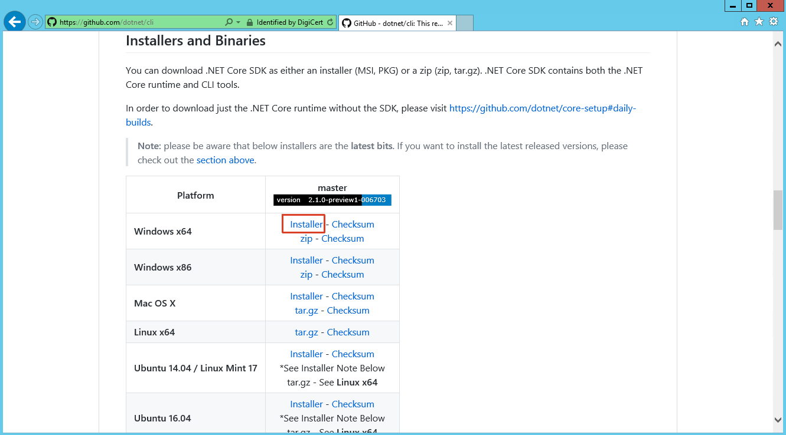

    1. E, finalmente, o  [comando Task Runner Visual Studio Extension](https://visualstudiogallery.msdn.microsoft.com/e6bf6a3d-7411-4494-8a1e-28c1a8c4ce99) .

        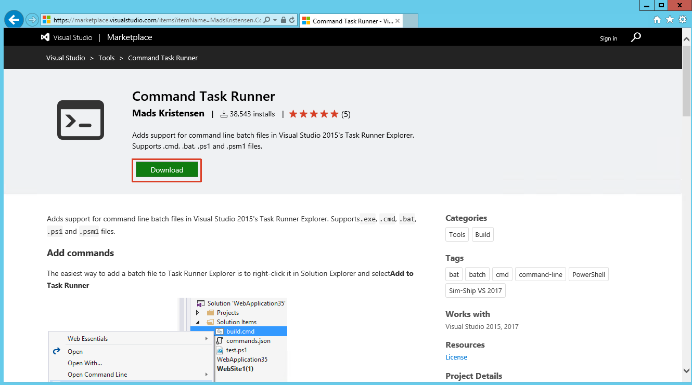

    1. Agora, inicie o Visual Studio e adicione a referência `, "Microsoft.Bot.Connector": "1.1.0"`ao arquivo `project.json`

        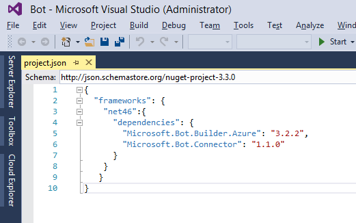

    1. Seu código de bot de baixado criado pelo serviço Azure Bot deve agora compilar e você também pode usar o `Bot Framework Emulator` para depurá-lo localmente.

Agora você viu uma maneira alternativa de criar e depurar um bot usando o Azure Bot Service. Um bot básico pode ser criado completamente sem um ambiente de desenvolvimento.

## **Resumo**

Neste laboratório prático, você aprendeu a:

* Configurar o ambiente em desenvolvimento para apoiar a criação de aplicativos de bot.
* Criar seu próprio bot a partir do zero.
* Criar seu próprio bot usando o serviço Azure Bot.
* Hospedandar seu bot em Azure.

---
Copyright 2017 Microsoft Corporation. All rights reserved. Except where otherwise noted, these materials are licensed under the terms of the MIT License. You may use them according to the license as is most appropriate for your project. The terms of this license can be found at https://opensource.org/licenses/MIT.
